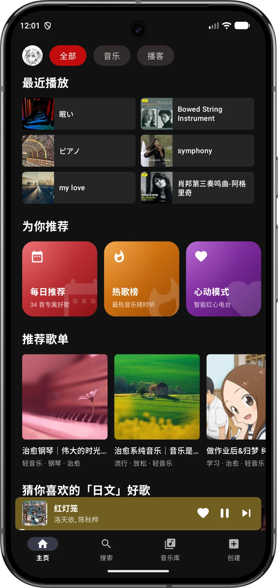
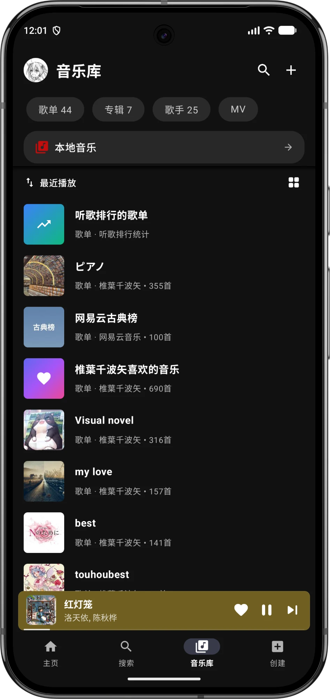
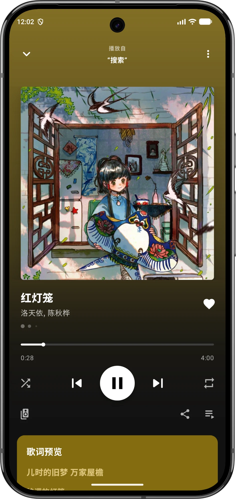
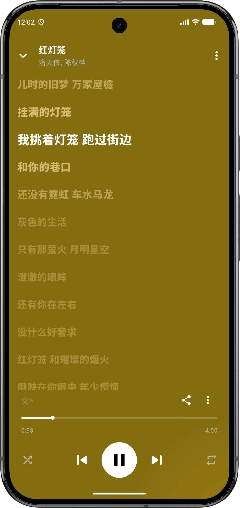
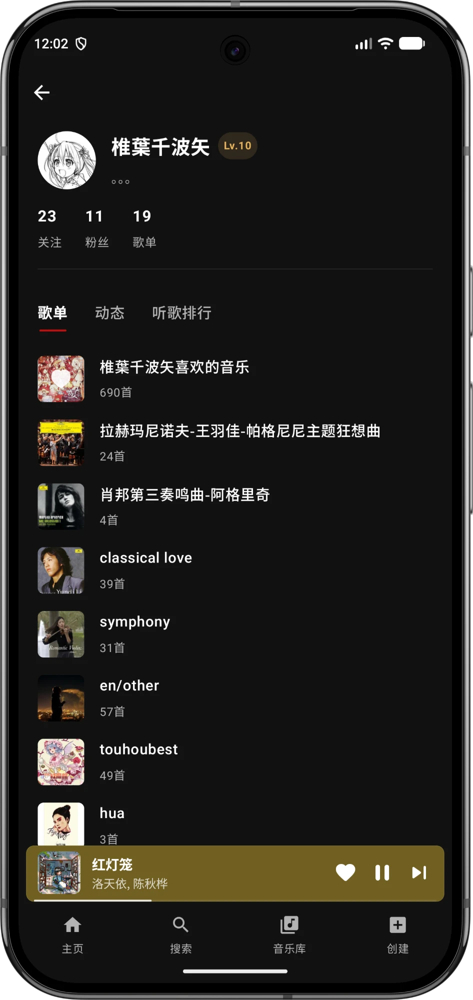
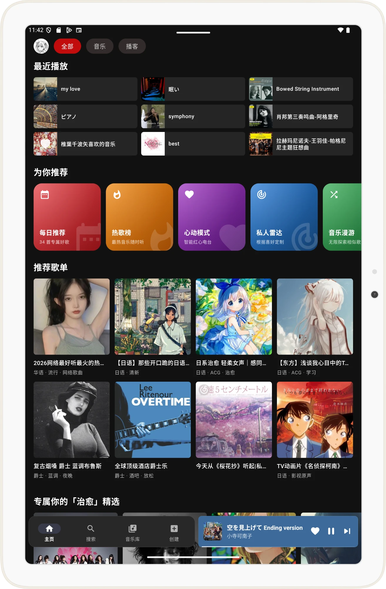
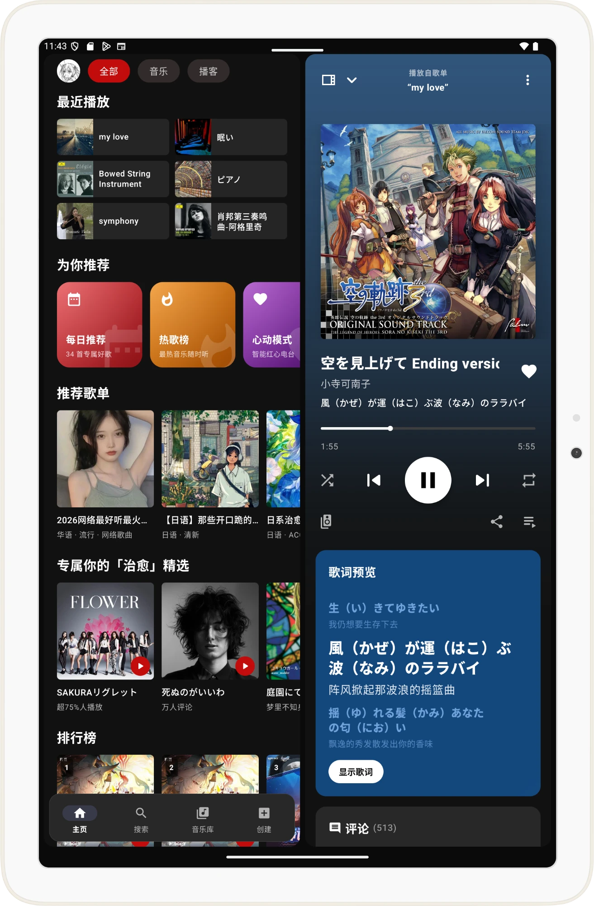
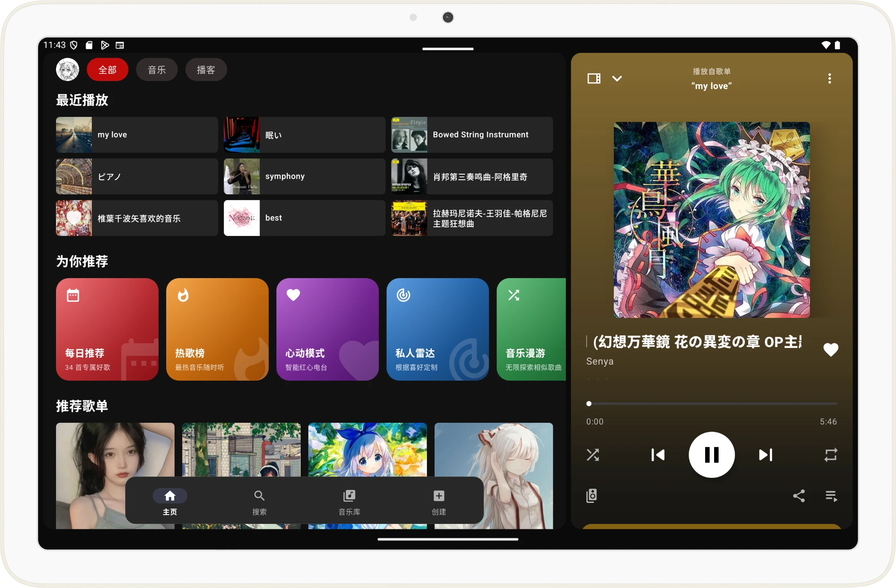
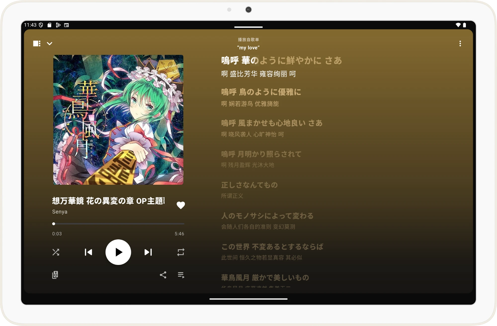
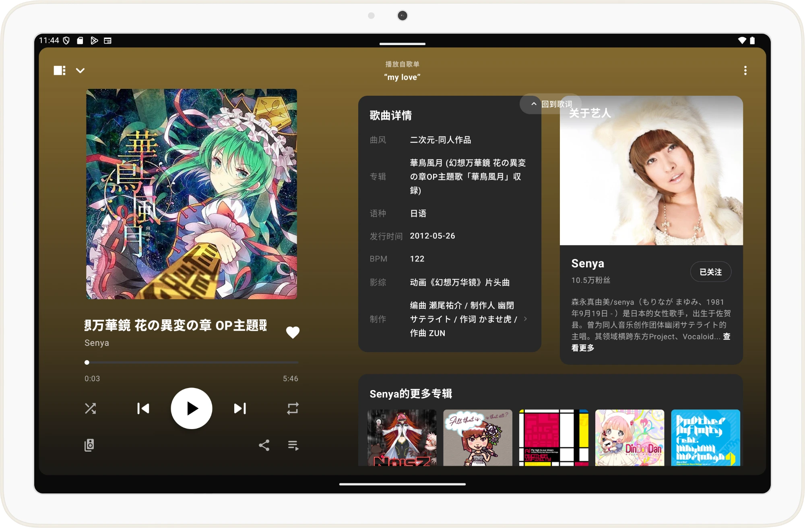

<div align="center">
  

参考Spotify UI构建的现代化、轻量级第三方网易云音乐客户端。


[](https://github.com/rinchao0721/Melodia/releases)
[](https://developer.android.com)
[](https://kotlinlang.org)
[](LICENSE)
</div>

---

## 截图预览

### 手机

<div align="center">
  
  
  
  
  
</div>

### 平板

<div align="center">
  
  
</div>
<div align="center">
  
  
  
</div>

---

## 下载与反馈

- **安装包下载**：前往 [GitHub Releases](https://github.com/rinchao0721/Melodia/releases) 获取最新预编译 APK
- **蓝奏云**：https://wware.lanzn.com/b01gic8ioj 密码:cem2
- **缺陷与建议**：[GitHub Issues](https://github.com/rinchao0721/Melodia/issues)
- **交流 QQ 群也可以下载**：`331832966`

---
## 项目架构

项目由三个 Gradle 模块组成，网易云接口、加密、数据仓储与大部分 ViewModel 只在 `shared` 中维护一份，Android 与桌面端各自负责界面和平台能力：

| 模块 | 类型 | 职责 |
|---|---|---|
| `shared` | Kotlin Multiplatform（Android + 桌面 JVM） | 数据模型、网络与原生加密、各业务域 `data` / `domain`、跨平台 ViewModel、播放器抽象 `PlaybackController` |
| `app` | Android 应用 | Jetpack Compose 界面、Media3 播放、下载、本地音乐、识曲、悬浮与系统歌词等 Android 专属能力 |
| `desktopApp` | Compose Desktop 应用（Windows） | 桌面窗口与界面、libmpv 播放、托盘、系统媒体控制（SMTC）与全局快捷键、桌面歌词 |

代码按**业务域 (Feature-Driven)** 组织：`core` 承载全局共享基础设施与通用能力，`feature` 下每个业务域自持 `data` / `domain` / `ui` 结构。依赖方向单向收敛——`feature` 依赖 `core`，`core` 不反向依赖 `feature`，各业务域之间解耦无循环依赖；`app` 与 `desktopApp` 都依赖 `shared`，两者互不依赖。

```text
shared/src/
├── commonMain/kotlin/com/lin0721/linmusic/
│   ├── core/                    # api、auth、network、model、preferences、player 抽象等共享基础能力
│   ├── feature/                 # 各业务域的 data / domain，以及已迁入的跨平台 ViewModel
│   └── di/                      # 网络与仓储的 Koin 模块，两端共用
├── androidMain/                 # Context 相关实现（DataStore 落盘、网络状态、音乐库偏好等）
└── desktopMain/                 # 桌面 JVM 平台实现（日志、设备信息等）

app/src/main/java/com/lin0721/linmusic/
├── MelodiaApplication.kt        # 应用程序入口：Koin 依赖注入初始化与 Coil 预热
├── MainActivity.kt              # 单 Activity 架构：系统窗口适应与悬浮窗权限引导
├── MelodiaApp.kt                # 顶层组合：导航骨架编排与播放器图层联动
├── MelodiaNavHost.kt            # 核心路由分发与平滑转场动画配置
├── MelodiaOverlays.kt           # 全屏播放器底栏、底部弹窗与全局反馈浮层
├── MelodiaNavigationState.kt    # 自定义导航回退栈管理与参数上下文恢复
├── MelodiaPlayerSheetState.kt   # 全屏播放器展开/收起手势状态机
├── MelodiaSidebarState.kt       # 侧边栏抽屉滑动状态机
├── core/                        # Android 专属基础能力（Media3 播放引擎、下载、Material 3 主题与组件、应用内更新等）
├── di/                          # Android 侧 Koin 模块（Local, Player, Download, Update, ViewModel 等）
└── feature/                     # 各业务域的 Compose 界面与 Android 专属 ViewModel（本地音乐、云盘、识曲等）

desktopApp/src/main/kotlin/com/lin0721/linmusic/desktop/
├── Main.kt                      # 应用入口：Koin 初始化、主窗口、托盘、全局快捷键与桌面歌词窗口
├── di/                          # Koin 模块注册；PlatformModule.kt 是全应用唯一的平台分支点
├── platform/                    # 跨平台通用能力（数据目录、偏好存储、日志、图片加载等），不含平台判断
│   └── native/                  # 平台原生能力：抽象与实现分离
│       ├── *.kt                 # 平台抽象接口：SystemMediaSession、GlobalHotkeyService、AutoStartManager、
│       │                        #   WindowDecoration、SystemAccentProvider、DesktopLyricBehavior
│       ├── windows/             # Windows 实现：Windows* 类 + winapi/（User32/Dwmapi）+ SmtcLibrary + RegistryCli
│       └── linux/               # Linux 实现：当前为 no-op 占位，后续填充 MPRIS/XDG/X11 等
├── player/                      # libmpv 的 JNA 绑定与 PlaybackController 实现（跨平台后端，不归入 platform/native）
└── ui/                          # 三栏布局、标题栏、首页、歌单、歌手、搜索、浏览、设置、播放条与歌词

desktopApp/native-src/           # 原生源码，按平台分目录（windows/、linux/）
desktopApp/native-src/windows/smtc/  # Windows SMTC 桥接 DLL 源码（C++/WinRT，CMake 构建）
```

**`platform/native` 组织规则**

- 根目录只放**平台抽象接口**，不放任何具体平台实现。
- 具体实现放平台子目录：`windows/`、`linux/`；类名带平台前缀（`Windows*` / `Linux*`），Windows 的 Win32/JNA 绑定统一放 `windows/winapi/`。
- 上层只依赖接口：`Main.kt`、`SettingsPage.kt`、`WindowChromeEffect.kt`、`DesktopLyricWindow.kt` 等只 `import platform.native.<接口>`，**禁止**直接引用 `windows/`、`linux/` 下的类。
- **唯一分支点**：平台判断集中在 `di/PlatformModule.kt`（按 `os.name` 选择并注册接口实现）。新增平台只需新增 `platform/native/<platform>/` 并在此登记，无需改动上层。
- 跨平台后端不归此目录：`player/mpv/` 保持原位，仅在内部按平台适配（如库名/搜索路径）。
- 通用文件留在 `platform/` 根：`DesktopPaths`、`DesktopPreferences`、`DesktopLogging`、`HotkeyBinding` 等不属于平台原生能力，不放进 `native/`。

---


## 统一错误处理

Repository 边界统一产出 Kotlin `Result<T>`，异常类型抽象为领域错误模型 `AppError`（包括网络中断、风控拦截、鉴权过期、数据解析失败及业务错误码）。UI 表现层针对不同错误语义分流呈现对应的重试引导或提示。

---

## 构建与开发

### 环境要求

- **JDK**：Java 21（推荐 Eclipse Temurin 21）
- **Gradle**：9.3+（项目内置 Gradle Wrapper 9.3.1）
- **Android Gradle Plugin (AGP)**：9.1.1+
- **Android SDK**：Compile / Target SDK 36，Min SDK 26 (Android 8.0+)
- **IDE**：Android Studio Ladybug (2024.2.1) 或更高版本
- **桌面端（仅在需要运行或打包时）**：
  - 64 位 Windows 10 及以上
  - `libmpv-2.dll`：使用 [media-kit](https://github.com/media-kit/media-kit) 提供的 Windows 纯音频 libmpv 构建，放到 `desktopApp/native/`（已在 `.gitignore` 中排除，不入库）
  - SMTC 桥接 DLL 由 Gradle 在运行与打包前自动调用 CMake 编译，需安装 CMake 与 Visual Studio（含“使用 C++ 的桌面开发”工作负载及 Windows 10/11 SDK）；缺少时跳过编译，运行时退回全局媒体键
  - 打包 MSI 需安装 [WiX Toolset 3.14](https://github.com/wixtoolset/wix3/releases) 并将其 `bin` 目录加入 `PATH`；打包所用 JDK 21 由 Gradle 工具链自动下载

### 常用命令

- **Android 调试构建**：
  ```bash
  ./gradlew :app:assembleDebug
  ```
- **运行单元测试**（`shared` 的测试跑在桌面 JVM 目标上）：
  ```bash
  ./gradlew :app:testDebugUnitTest :shared:desktopTest
  ```
- **构建 Android Release 安装包**：
  ```bash
  ./gradlew :app:assembleRelease
  ```
- **运行桌面端**：
  ```bash
  ./gradlew :desktopApp:run
  ```
- **打包桌面端**（发布版启用 ProGuard 裁剪，产物位于 `desktopApp/build/compose/binaries/main-release/`）：
  ```bash
  ./gradlew :desktopApp:packageReleaseZip :desktopApp:packageReleaseMsi
  ```

### 混淆与签名说明

- **代码裁剪与混淆**：`release` 构建已开启 R8 压缩与混淆保护。项目对 Retrofit 接口与 `@Serializable` 数据传输类配置了显式 Keep 规则，确保混淆后的运行安全。
- **签名机制**：签名材料从版本控制外部注入（读取 `local.properties` 或 CI 环境变量）。若未配置正式签名，将自动回退为 Debug 签名，确保本地可编译出可运行的 APK。完整签名与自动化发版配置请参阅 [RELEASE_SIGNING.md](RELEASE_SIGNING.md)。
- **CI 流水线**：向 `main` 分支推送或提交 PR 时自动运行 `app` 与 `shared` 的单元测试、桌面端编译检查与 Android Release 构建验证；推送版本 Tag 时触发 Android 正式签名打包并发布 GitHub Release。

---

## 非常感谢

- [NeteaseCloudMusicApi](https://github.com/binaryify/NeteaseCloudMusicApi) - 网易云音乐 API 分析与实现参考
- [api-enhanced](https://github.com/NeteaseCloudMusicApiEnhanced/api-enhanced) - 增强接口与加密逻辑参考
- [node-vibrant](https://github.com/Vibrant-Colors/node-vibrant) - 取色算法参考
- [SPlayer](https://github.com/SPlayer-Dev/SPlayer) - 现代流媒体架构设计启发
- [AMLL 歌词库](https://github.com/amll-dev/amll-ttml-db) - TTML 逐字歌词、对唱与背景和声歌词来源
- [Spotify](https://spotify.com) - 优秀的移动端流媒体交互范式与 UI/UX 体验灵感
- [SuperLyric](https://github.com/HChenX/SuperLyric) - 系统级实时歌词协议与 AIDL 规范
- [LyricInfo](https://github.com/limczhh/LyricInfo) - 蓝牙/系统歌词协议规范
- [Lyricon](https://github.com/proify/Lyricon) - 词幕协议广播规范
- [mpv](https://github.com/mpv-player/mpv) - 桌面端音频播放内核 libmpv
- [media-kit](https://github.com/media-kit/media-kit) - 精简的纯音频 libmpv 构建
- [Compose Multiplatform](https://github.com/JetBrains/compose-multiplatform) - 跨平台共享层与桌面端界面框架
- [JNA](https://github.com/java-native-access/jna) - 桌面端调用 libmpv 与 Win32 接口
- [TagLib](https://github.com/Kyant0/taglib) - 本地音乐标签读写

---

## 免责声明

1. 本项目为个人技术交流与 Android 现代原生架构学习研究所用。
2. 本项目不包含任何商业目的，不提供任何形式的商业变现或增值服务。
3. 软件中调用的所有音频及元数据均来源于公开网络接口，版权归属于原权利人所有。请在下载安装后 24 小时内删除，严禁用于任何商业用途。
